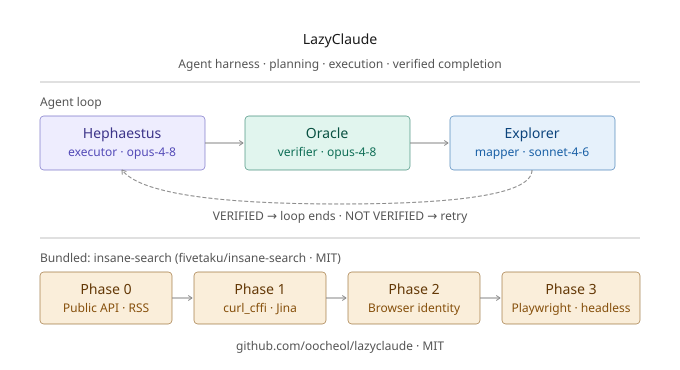

<div align="center">
  <h1>LazyClaude</h1>
  <p><strong>The one and only agent harness for complex codebases.</strong><br />
  Project memory, planning, execution, and verified completion inside Claude Code.</p>
  
  <p>
    <a href="https://github.com/oocheol/lazyclaude">GitHub</a> ·
    <a href="#insane-search-web-bypass-engine">insane-search</a> ·
    <a href="#commands">Commands</a> ·
    <a href="#skills">Skills</a>
  </p>
</div>

---

> Inspired by [LazyCodex](https://github.com/code-yeongyu/lazycodex) / [OmO](https://github.com/code-yeongyu/oh-my-openagent) — ported for Claude Code.
>
> Think LazyVim for Neovim, but for Claude Code.

## Install

**Option 1 — npx (no global install)**
```bash
npx lazyclaude install
```

The installer clones the current upstream `HEAD` into the Claude config
directory. Existing or user-modified command files are preserved. To run a
project with the complete plugin loaded, use:

```bash
npx lazyclaude run -- <claude arguments>
# for example:
npx lazyclaude run -- --help
```

This invokes `claude --plugin-dir <installed-lazyclaude> ...`. Claude Code's
official plugin loading mechanism is documented in its
[plugin documentation](https://code.claude.com/docs/en/plugins). A bare clone
under `~/.claude/plugins` is not automatically loaded, so use `run` (or pass
the plugin directory explicitly) when you need agents and skills. The
installer also keeps standalone command aliases in
`~/.claude/commands`; these remain available as `/ulw-loop`, `/ulw-plan`,
`/start-work`, and `/init-deep`.

When the full plugin is loaded, the same commands are namespaced as
`/lazyclaude:ulw-loop`, `/lazyclaude:ulw-plan`,
`/lazyclaude:start-work`, and `/lazyclaude:init-deep`.

**Option 2 — global install**
```bash
npm install -g lazyclaude
lazyclaude install
```

**Option 3 — Claude Code plugin (git)**
```bash
git clone https://github.com/oocheol/lazyclaude ~/.claude/plugins/lazyclaude
claude --plugin-dir ~/.claude/plugins/lazyclaude
```

The `--plugin-dir` flag is required for this source checkout. The repository
does not auto-register itself with Claude Code; there is no build step.
On Windows, `run` requires a native `claude.exe`; if Claude is available only
as `claude.cmd`, invoke it directly with the `--plugin-dir` flag or configure
`LAZYCLAUDE_CLAUDE_BIN` to a native executable.

## Commands

Invoke with `/command-name` in Claude Code.

| Command | What it does |
|---------|-------------|
| `/ulw-loop "task"` | Self-referential loop until Oracle-verified completion (cap: 100 iterations) |
| `/ulw-plan "what to build"` | Decision-complete plan written to `plans/<slug>.md` — never touches product code |
| `/start-work [plan-name]` | Executes a plan step-by-step until every checkbox is done. Prints **ORCHESTRATION COMPLETE** |
| `/init-deep` | Generates hierarchical `CLAUDE.md` project memory across top-N complex directories |

## Skills

Auto-triggered by Claude based on context.

| Skill | Triggers when... |
|-------|-----------------|
| `programming` | User asks for implementation with correctness emphasis |
| `review-work` | "review what I just did", "is this ready to merge" |
| `init-deep` | "create project memory", agents keep making wrong assumptions |

## Agent Roles

Three discipline agents work together:

| Agent | Model | Role |
|-------|-------|------|
| **Hephaestus** | `opus` | Executor — does the work, verifies output |
| **Oracle** | `opus` | Verifier — binary VERIFIED / NOT_VERIFIED verdict |
| **Explorer** | `sonnet` | Read-only mapper — finds things, never edits |

## Model Routing

Agent roles use provider model aliases (`opus`, `sonnet`, and `haiku`), not
fixed dated model-version strings. The aliases resolve according to the
Claude Code installation; this plugin does not add provider integrations.

| Task | Model |
|------|-------|
| Complex code, planning, verification | `opus` |
| Exploration, quick lookups | `sonnet` |
| Parallel subtasks, fast ops | `haiku` |

## How it works

### `/ulw-loop`

```
Hephaestus executes → Oracle judges → loop until VERIFIED
```

Oracle only returns `VERIFIED` when evidence directly proves the completion promise. "Tests pass" without output is not evidence.

### `/ulw-plan`

Reads the codebase, writes a decision-complete plan to `plans/<slug>.md` with ordered checkboxes and an explicit Definition of Done. Never writes product code.

### `/start-work`

Reads a plan, executes each unchecked step via Hephaestus, runs verification after each step, marks checkboxes as it goes. Prints **ORCHESTRATION COMPLETE** when all DoD items pass.

### `/init-deep`

Scores directories by complexity, reads representative files, writes local `CLAUDE.md` files with purpose/conventions/pitfalls. Updates root `CLAUDE.md` with project overview.

## Utilities

```bash
npx lazyclaude doctor    # health check — plugin dir, commands, skills
npx lazyclaude update    # pull latest
npx lazyclaude uninstall # remove plugin
```

---

## insane-search: Web Bypass Engine

> Bundled from [fivetaku/insane-search](https://github.com/fivetaku/insane-search) — auto-bypass for blocked websites inside Claude Code.

플러그인이 로드되고 모델이 이 스킬을 선택하면, Claude Code의 기본
WebFetch가 차단되거나 403/CAPTCHA를 만났을 때 `insane-search`가 공개
콘텐츠 취득을 시도할 수 있습니다. 이는 보장된 런타임 훅이 아닙니다.

### 작동 방식

```
WebFetch 실패 → insane-search 개입
       │
       ▼
  Phase 0: 공식 API / RSS / oEmbed
       │ 실패
       ▼
  Phase 1: Jina Reader · curl_cffi TLS 위장
       │ 실패
       ▼
  Phase 2: 완전한 브라우저 신원 스푸핑 (TLS fingerprint + cookie)
       │ 실패
       ▼
  Phase 3: Playwright 헤드리스 브라우저 → 내부 JSON API 역추적
```


### 지원 플랫폼

| 카테고리 | 사이트 |
|----------|--------|
| 소셜 | X/Twitter, Reddit, Bluesky, Mastodon, Threads |
| 동영상 | YouTube (yt-dlp, 1,858개 사이트) |
| 개발 | GitHub, Stack Overflow, Hacker News, arXiv |
| 블로그 | Medium, Substack |
| 한국 | Naver, Coupang, DCInside, FMKorea, yozm |
| 비즈니스 | LinkedIn |
| 기타 | RSS/Atom 피드가 있는 모든 사이트 |

### 사용법

The skill can invoke the engine when Claude Code has loaded this plugin; it
does not install dependencies or make network access available by itself.

From a source checkout, run the module from the engine's parent directory:

```bash
cd skills/insane-search
python -m engine "<URL>" [--selector "<CSS>"] [--device auto|desktop|mobile]
```

For an installed copy, replace the `cd` path with
`<Claude config>/plugins/lazyclaude/skills/insane-search` (the installer
typically uses `~/.claude/plugins/lazyclaude/skills/insane-search`).

### 경계

- **공개 콘텐츠만** — 로그인 월, 페이월은 시도하지 않음
- **의존성** — optional transports such as `curl_cffi` and `yt-dlp` may need
  to be installed separately; offline checks use only the Python standard
  library.
- **API 키 불필요** — 외부 설정 없이 동작

---

## Architecture

```
lazyclaude/
├── .claude-plugin/plugin.json   ← Claude Code plugin manifest
├── commands/                    ← /ulw-loop, /ulw-plan, /start-work, /init-deep
├── skills/
│   ├── programming/             ← 구현 품질 스킬
│   ├── review-work/             ← 코드 리뷰 스킬
│   ├── init-deep/               ← 프로젝트 메모리 생성
│   └── insane-search/           ← WAF 우회 웹 접근 엔진 ← NEW
│       ├── SKILL.md
│       ├── engine/              ← Python 엔진 (phase0~3, TLS, Playwright)
│       └── references/          ← 플랫폼별 전략 문서
├── agents/                      ← hephaestus, oracle, explorer
├── setup/setup.sh               ← first-run idempotent setup
├── bin/lazyclaude.js            ← npx installer
└── package.json
```

## License

MIT

## Tests

Offline checks require only Node.js 18+ and Python 3.10+:

```bash
npm test
npm run test:python
```

The Python command runs deterministic engine checks from
`skills/insane-search`; tests that contact live sites are separate and are not
part of the offline CI gate. No API keys or real Claude/API workflow calls are
used by these checks.
